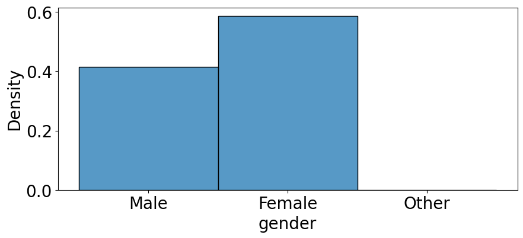
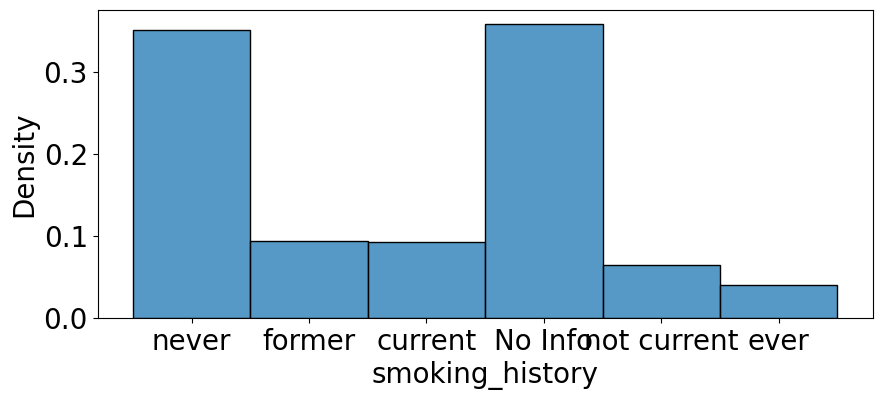
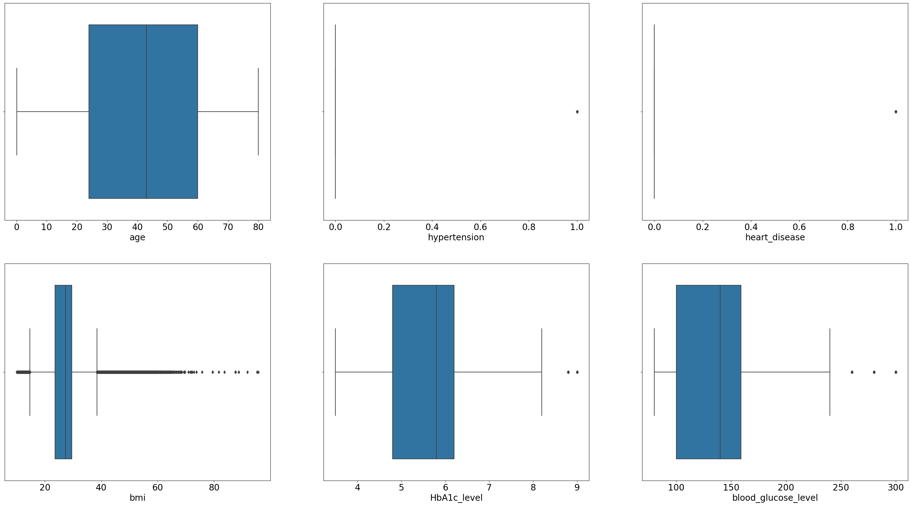
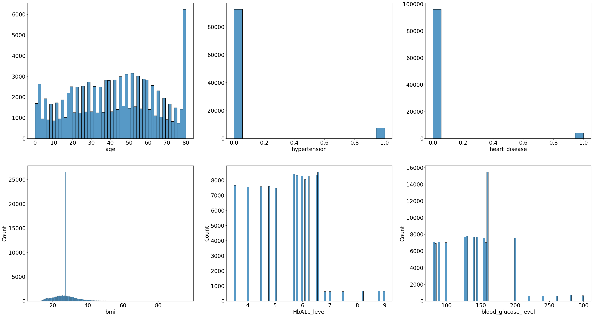
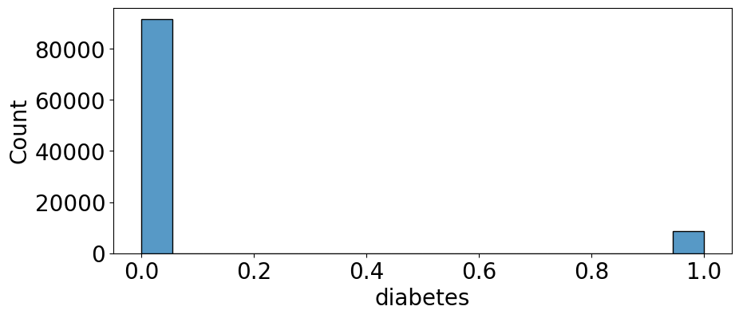
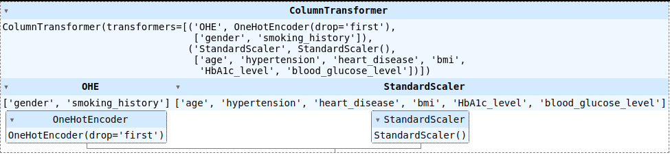
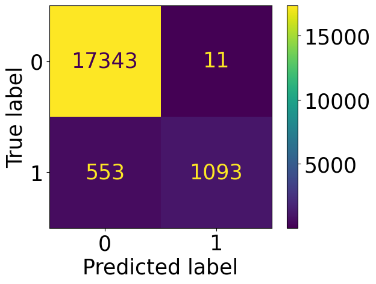
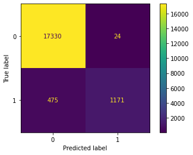

# Diplomatura en ciencia de datos, aprendizaje automático y sus aplicaciones - Edición 2023 - FAMAF (UNC)

## Resolución del entregable de **aprendizaje supervisado**

### **Grupo 22:**

**Integrantes:**
- [Chevallier-Boutell, Ignacio José](https://github.com/Cheva94)
- [Ribetto, Federico Daniel](https://github.com/federibet)
- [Rosa, Santiago](https://github.com/santrosa)
- [Spano, Marcelo](https://github.com/marcespano)

**Seguimiento:** Meinardi, Vanesa

---

## Introducción

En este entregable se pretende participar de una competencia de Kaggle, donde el dataset es una recopilación de datos méedicos y demográficos de pacientes junto a su estado de diabetes.

El dataset consta de un total de 100000 registros: 95000 se utilizan en la etapa de entrenamiento, mientras que los otros 5000 son para la evaluación del modelo. Cada registro tiene 10 variables: además del ID del paciente y su estado de diabetes, hay 2 variables categóricas (sexo e historial de fumador) y 6 variables numéricas (edad, hipertensión, enfermedades cardíacas, índice de masa corporal, hemoglobina glicosilada y glucemia).

El objetivo es construir modelos que predigan si una persona tiene o no diabetes. Teniendo como referencia un árbol de decisión cuya exactitud es del 0.97266, al menos uno de nuestros modelos debe superar dicho valor.

## Exploración

### Datos faltantes

Salvo las etiquetas que fueron eliminadas a propósito en el conjunto de datos de evaluación, no se tienen valores faltantes.

### Variables categóricas

Se puede observar que cada variable categórica posee pocas categorías. Además se observa que son variables nominales.

La variable del `sexo` tiene 3 opciones posibles: varón, mujer y otro. La variable `historial de fumador` tiene 6 opciones posibles: sin información, nunca, fumaba, fuma actualmente, no fuma actualmente y siempre.

Respecto a `sexo` hay casi un 60% de mujeres y un 40% de varones, por lo que no hay un gran desbalance entre estas dos categorías. Sí está extremadamente desbalanceado con otros: hay mucho menos que el 1%.

Respecto a `historial de fumador` las dos categorías más preponderantes con un 35% cada una son nunca y sin información, llevándose prácticamente el 70% de los datos. Las otras cuatro categorías ocupan el 30% restante de una manera más o menos equitativa.

### Variables numéricas

En ningún caso se observan outliers significativos, por lo que se decide no realizar ninguna eliminación ni imputación.

Las variables `hipertensión` y `enfermedad cardíaca` son en realidad respuestas binarias: 0 es que no tiene y 1 es que sí. En ambas variables hay desbalance: la enorme mayoría tiene valor 0.

La `edad` ocupa desde 0 a 80 años, habiendo un pico distintivo en torno a los 80, pero el resto de las edades están bastante distribuidas.

Tanto la `hemoglobina glicosilada` como la `glucemia` presentan unos pocos valores elevados, pero los demás tiene una buena distribución. La mayoría están alrededor de 6 para la `hemoglobina glicosilada`, lo que significa que muchos se encuentran en la zona umbral. Luego, la mayoría están alrededor de 150 para la `glucemia`, encontrándose ya unos 25 puntos por encima del umbral.

Finalmente, el `índice de masa corporal`va desde 10 hasta 96, aunque el 75% de los valores se encuentra por debajo de los 30, ubicándose entre valores normales y sobrepeso.

### Variable objetivo

Las clases están super desbalanceadas: más del 80% corresponden a personas no diabéticas.

## Preprocesamiento

Armamos un pipeline de preprocesamiento, el cual se encarga de:
* Mapeamos las variables categíricas a numéricas utilizando one-hot encoding.
* Normalizamos las variables categóricas.

Lo guardamos en un archivo pkl para utilizarlo al inicio de los modelos.

## Redes neuronales

Las **redes neuronales totalmente conectadas** son modelos de machine learning que sirven para estimar una función mediante el aprendizaje de muchos ejemplos de la misma. En nuestro caso, utilizamos una red totalmente conectada de tres capas ocultas, cuya entrada son las 13 variables del archivo pkl, y la salida son dos neuronas, donde cada una es la probabilidad del tipo de diabetes. La estructura de la red es la siguiente:

* Entrada (13 neuronas)
* Capa totalmente conectada de 104 neuronas
* ReLU
* Capa totalmente conectada de 208 neuronas
* ReLU
* Capa totalmente conectada de 52 neuronas
* ReLU
* Salida con Softmax (2 neuronas)

Al dataset lo dividimos en: 80% entrenamiento, 10% validación y 10% testing. Acá entra un nuevo tipo de dataset: en cada época de entrenamiento se usa el dataset de validación para comparar lo aprendido con el dataset de entrenamiento, y una vez entrenada la red, se evalúa su performance con el dataset de testing, dataset que la red aún no vio y por lo tanto son datos nuevos. Dado que los datos entran en memoria, el tamaño de minibatch utilizado es el dataset de entrenamiento entero.

A la red se la entrenó durante 300 épocas con una taza de aprendizaje de 0.0005 usando el optimizador ADAM, y la entropía cruzada como función de costo, la cual es óptima para problemas de clasificación binaria. En cada paso de entrenamiento se aplicó un dropout de 0.5. Todas las capas tienen bias.

La máxima precisión alcanzada fue de 97,30% (score privado) con esta configuración. Utilizamos todos estos hiperparámetros y configuración de la red con el viejo y confiable método de prueba y error, dado que son demasiados parámetros al mismo tiempo para hacer un gridsearch. Por ejemplo, descubrimos que si usamos múltiplos de 13 en el número de neuronas de las capas ocultas, obteníamos una mejora de la clasificación. Probamos redes de una y dos capas pero estas nunca superaron el 96% de efectividad. También intentamos asignarle pesos al optimizador para que pondere los casos de diabetes tipo 1, que es la minoría, pero la red se sesgaba mucho y no obteníamos una precisión aceptable (menos de 90%).

## Máquinas de vectores de soporte

Las **máquinas de vectores de soporte (support-vector machines, SVM)** son clasificadores binarios y, en principio, lineales, las cuales, a diferencia del perceptrón, sí contemplan la optimización de la frontera de decisión que permite separar las dos clases: se busca aquel hiperplano que esté lo más separado posible de los puntos más cercanos al mismo. Dichos puntos son conocidos como **vectores de soporte**, mientras que el espacio entre ellos y el hiperplano se conoce como **margen**. Con esto presente, podemos decir que el algoritmo SVM encuentra el hiperplano que devuelve el mayor margen entre sí mismo y los vectores de soporte. Por esta razón es que este tipo de clasificador a veces es conocido como **clasificador por márgenes (margin classifier)**. Se dice que en principio es un clasificador lineal ya que es excelente para claificar conjuntos que son linealmente separables. Sin embargo, cuando las clases no son estrictamente linealmente separables, pero presentan un solapamiento moderado, se define una **tolerancia (C)** al error: permitimos que haya datos que caigan dentro del margen de error o incluso que estén del lado incorrecto del hiperplano. Existen problemas de clasificación complejos imposibles de resolver usando funciones lineales, incluso tomando una tolerancia. En estos casos, se puede generalizar SVM para que considere funciones no lineales sobre el espacio de parámetros original. Esto se logra al recurrir al **Kernel trick**: mapear los datos sobre un espacio de mayores dimensiones donde se espera, con alta probabilidad, que las clases sí sean linealmente separables.

Teniendo todo esto en cuenta, se hizo un barrido de hiperparámetros, variando: `C` (tolerancia), `Kernel` (Kernel a utilizar en el mapeo), `class_weight` (si considera o no un balanceo entre las clases presentes) y `degree` (grado del polinomio, en caso de un Kernel polinómico). La combinación óptima resultó ser:
* `C` = 1E3
* `Kernel` = 'poly'
* `class_weight` = None (default)
* `degree` = 3 (default)

Con estos hiperparámetros, los valores de accuracy y la matriz de confusión obtenidos son:
* Entrenamiento: 96.916%
* Validación: 97.032%

Al submitir las predicciones de este modelo en la competencia Kaggle, se obtuvo un score de 97.133%, estando 0.133% por debajo del baseline.

## XGBoost

**XGBoost (eXtreme Gradient Boosting)** es una librería/algoritmo de aprendizaje automático que pertenece a la categoría de boosting, ya que combina múltiples árboles débiles para crear un modelo fuerte y preciso. Se puede utilizar tanto en problemas de clasificación como de regresión.

En lugar de ajustar un hiperplano para separar las clases, como lo hace SVM, XGBoost crea una combinación ponderada de varios árboles de decisión. Cada árbol se construye de manera secuencial para mejorar el rendimiento del modelo general. Los árboles posteriores se centran en corregir los errores cometidos por los árboles anteriores, lo que permite al modelo aprender patrones más complejos y capturar relaciones no lineales entre las características y las etiquetas.

Una de las grandes ventajas de este algoritmo es la alta velocidad computacional ya que se encuentra optimizado para procesamiento en paralelo. Además, puede manejar grandes conjuntos de datos.

Se realizó un barrido de los siguientes hiperparámetros:
* `subsample`: Es la proporción de muestras del conjunto de entrenamiento que se utiliza para entrenar cada árbol de decisión individual en el proceso de boosting.
* `scale_pos_weight`: Controla el balance de pesos positivos y negativos.
* `reg_lambda`: Regularización L2 aplicada a los pesos de los modelos de árboles de decisión durante el proceso de entrenamiento. Es utilizado para prevenir el sobreajuste.
* `reg_alpha`: Regularización L1 aplicada a los pesos de los modelos de árboles de decisión durante el proceso de entrenamiento. Es utilizado para prevenir el sobreajuste.
* `n_estimators`: Número de árboles de decisión que se construirán en el proceso de entrenamiento.
* `min_child_weight`: Peso mínimo que se permite en cada nodo hoja de los árboles de decisión durante el proceso de construcción.
* `max_depth`: Máxima profundidad de los árboles.
* `learning_rate`: Tasa de aprendizaje con la que el algoritmo ajusta los pesos de los modelos de árboles durante el proceso de entrenamiento.
* `gamma`: Umbral que controla cuándo se crean nuevas hojas (nodos terminales) en los árboles de decisión durante el proceso de construcción.
* `colsample_bytree`: Proporción de características (columnas) del conjunto de entrenamiento que se utilizarán al construir cada árbol de decisión durante el proceso de entrenamiento.

La combinación óptima resultó ser:

* `subsample`: 1.0
* `scale_pos_weight`: 1
* `reg_lambda`: 1.0
* `reg_alpha`: 0.5
* `n_estimators`: 200
* `min_child_weight`: 1
* `max_depth`: 4
* `learning_rate`: 0.1
* `gamma`: 0
* `colsample_bytree`: 1.0

Con estos hiperparámetros, los valores de accuracy y la matriz de confusión obtenidos son:
* Entrenamiento: 97.23%
* Validación: 97.37%

Al submitir las predicciones de este modelo en la competencia Kaggle, se obtuvo un score público de 97.2%, estando 0.066% por debajo del baseline. Además, se obtuvo un score privado de 97.371%.

## Conclusiones

* Logramos obtener tres modelos de aprendizaje para pronosticar diabetes de tipo 0 y 1: una red neuronal, un clasificador SVM y un clasificador xgboost, los tres superando el 97% de precisión.
* Logramos superar la precisión requerida por la competencia Kaggle del entregable.
* El método óptimo fue el xgboost.
